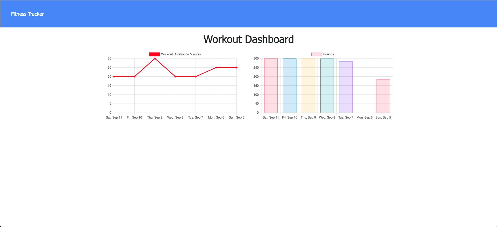

# Unit-18-Nosql-Fitness-Tracker

   

## Deployment
[Fitness-Tracker](https://fitness-tracker.ethanharsh.com/)

## Application Screenshot

## Description

Track your fitness and reach your goals!

## Project Goals:

- Create, Read, and Update MongoDB data using Mongoose
- Create an API
- Test API with Postman

## Skills Learned

- [Express](https://www.npmjs.com/package/express)
- [Node.js](https://developer.mozilla.org/en-US/docs/Glossary/Node.js?utm_campaign=feed&utm_medium=rss&utm_source=developer.mozilla.org)
- [mongoose](https://www.npmjs.com/package/mongoose)
- [MongoDB](https://www.mongodb.com/)

## Resources

- [Node.js Documentation](https://nodejs.org/en/docs/)
- [Mongoose](https://mongoosejs.com/docs/api.html)
- [MongoDB](https://docs.mongodb.com/guides/)
- **General Reference ->** [MDN](https://developer.mozilla.org/en-US/)